# [Finite State](https://finitestate.io) `binary-scan` Extension for Azure DevOps

[finitestate.io](https://finitestate.io)

## Description

The Finite State `binary-scan` Extension allows you to easily integrate the Finite State Platform into your Azure Devops Pipeline.

Following the steps below will: 
* Upload the file to the Finite State platform
* Create a new version of the configured asset
* Conduct a Quick Scan binary analysis on the uploaded file
* Associate the results to the asset version

By default, the asset version will be assigned the existing values for Business Unit and Created By User. If you need to change these, you can provide the IDs for them.

## Inputs

| parameter                         | description                                                                                                                                         | required | type | default |
| --------------------------------- | --------------------------------------------------------------------------------------------------------------------------------------------------- | -------- | -------- | ------- |
| finiteStateClientId            | Finite State API client ID                                                                                                                           | `true`   | `string`   |         |
| finiteStateSecret               | Finite State API secret                                                                                                                              | `true`   | `string`   |         |
| finiteStateOrganizationContext | The Organization-Context should have been provided to you by your Finite State representative and looks like `xxxxxxx-xxxx-xxxx-xxxx-xxxxxxxxxxxx`                    | `true`   | `string`   |         |
| assetId                          | Asset ID for the asset that the new  asset version will belong to                                                                                                             | `true`   | `string`   |         |
| version                           | The name of the asset version that will be created                                                                                                  | `true`   | `string`   |         |
| filePath                         | Local path of the file to be uploaded                                                                                                                   | `true`   | `string`   |         |
| quickScan                        | Boolean that uploads the file for quick scan when true. Defaults to true (Quick Scan). For details about the contents of the Quick Scan vs. the Full Scan, please see the API documentation. | `false`   | `boolean`   | `true`    |
| automaticComment | Defaults to false. If it is true, it will generate a comment in the PR with the link to the Asset version URL in the Finite State Platform. | `false`  | `boolean`   | `false` |
| businessUnitId                  | (optional) ID of the business unit that the asset version will belong to. If not provided, the asset version will adopt the existing business unit of the asset.                | `false`  | `string`   |         |
| createdByUserId                | (optional) ID of the user to be recorded as the 'Created By User' on the asset version. If not provided, the  version will adopt the existing value of the asset.            | `false`  | `string`   |         |
| productId                        | (optional) ID of the product that the asset version will belong to. If not provided, the existing product for the asset will be used, if applicable.              | `false`  | `string`   |         |
| artifactDescription              | (optional) Description of the artifact. If not provided, the default is "Firmware Binary".                                                          | `false`  | `string`   |         |

## Set Up Workflow

To start using this Extension, you must [install](https://learn.microsoft.com/en-us/azure/devops/marketplace/install-extension?view=azure-devops&tabs=browser) using [Azure DevOps Markeplace](https://marketplace.visualstudio.com/items?itemName=christian-azr.binary-scan)

After is installed, you could use it in your pipeline finding the task in the right Tasks panel:

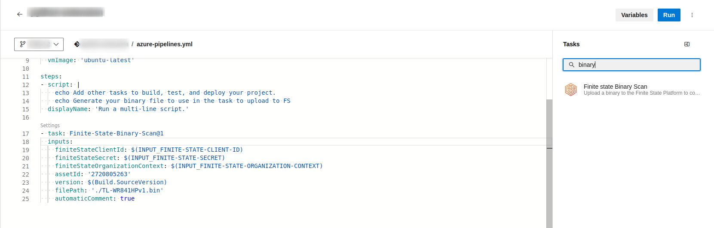

You could customize the input parameters as you could see in the next image:

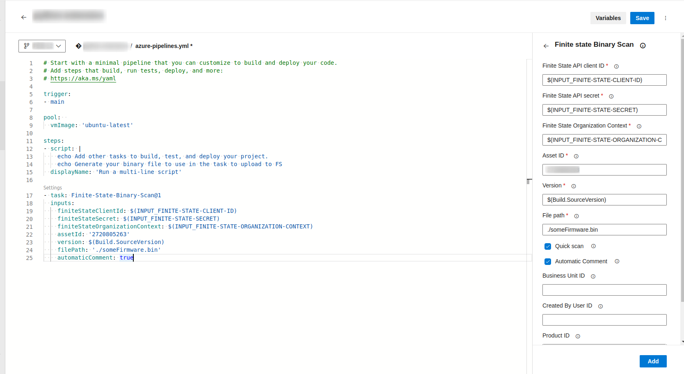

Although you could write some values directly in the input fields, we recommend to keep secret some sensitive values instead of hardcoded directly in the pipeline yml file. At least you should keep secret this inputs:
- FiniteState Client ID, 
- FiniteState Secret ID and 
- FiniteState Context organization

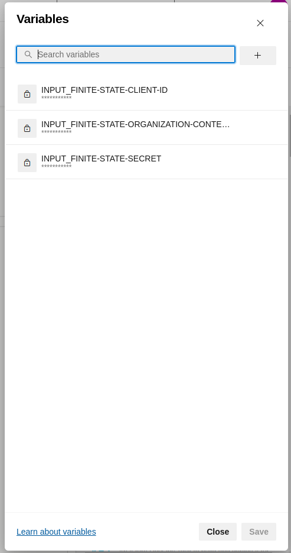

## Generate comment on a PR with the link to upload binary file
If you want the PR to automatically generate a comment with the link to the results on the Finite State Platform, make sure to give permissions to the azure pipeline token [`System.AccessToken`](https://learn.microsoft.com/en-us/azure/devops/pipelines/build/variables?view=azure-devops&tabs=yaml#systemaccesstoken). Then, grant the necessary permissions over the associated Azure Token going to `Project Settings > Repositories > Security tab` as you could see in the follow image:

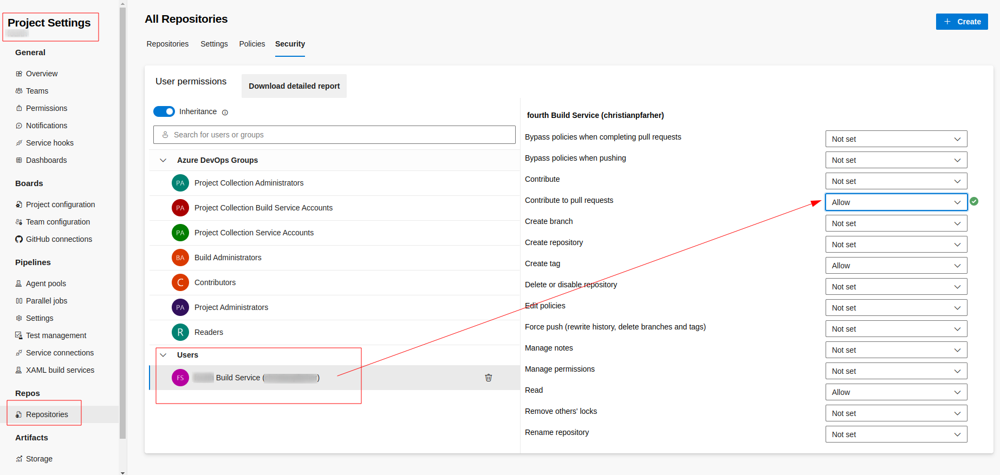

This allows the action to post the comment in the PR when the `automaticComment` is checked (`true`). After this steps you will get a comment in the PR with the link that points to the binary uploaded fine to FiniteState Platform:

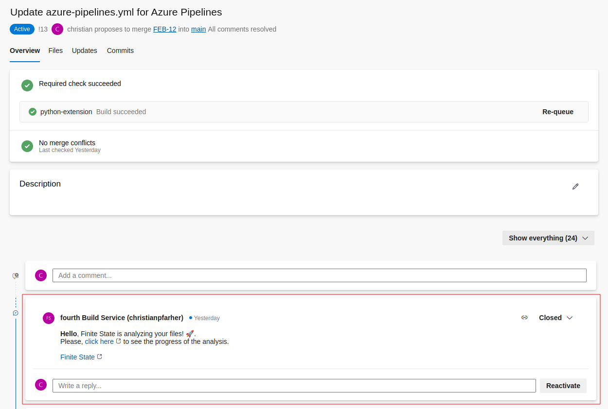

### Build Policy
You will need to configure a build policy over your main branch in order to auto start a build process. So on this way, when you did a modification over a branch that has a PR associated, the pipeline will be executed automatically, therefore it will generate the comment using the task configured.

To set up a policy you need to go to `Repositories > Branches`. Then click on the three point in your main branch and select Branch policies in the dropdown menu:

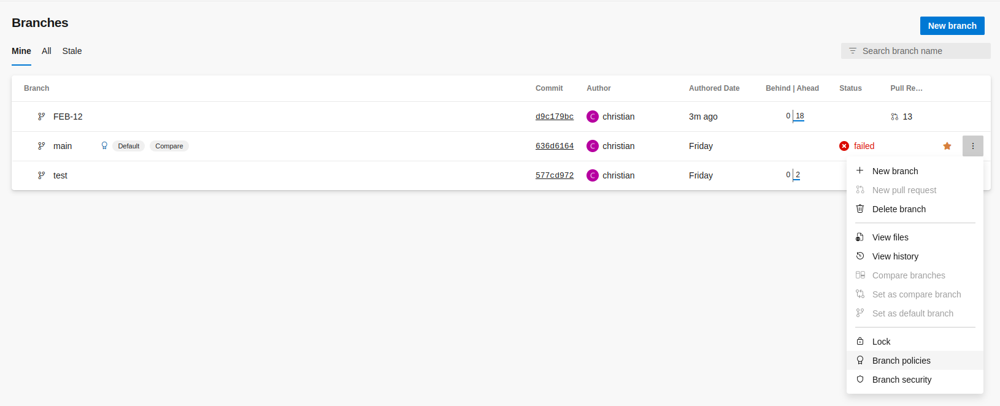

In the popup save the settings as follow:

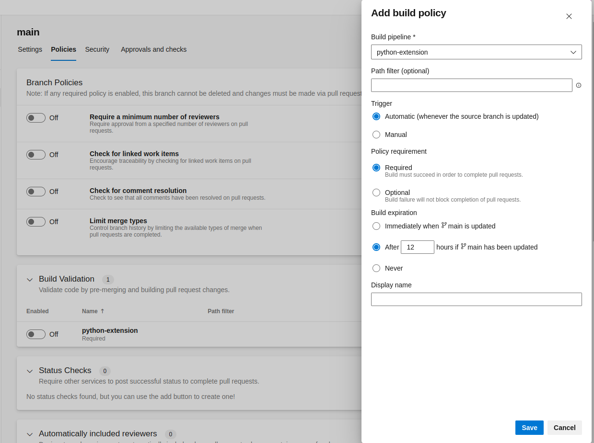

After that you will see a setting similar to this:

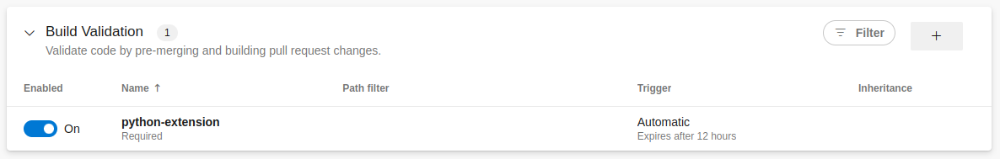

From now, on each commit over a branch associated to a PR that is requested to be merge in main branch it will trigger the pipeline execution automatically to execute the Finite State task:

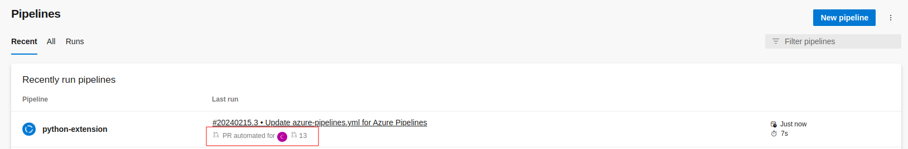

The extension will shows some information/details about the result of the execution:

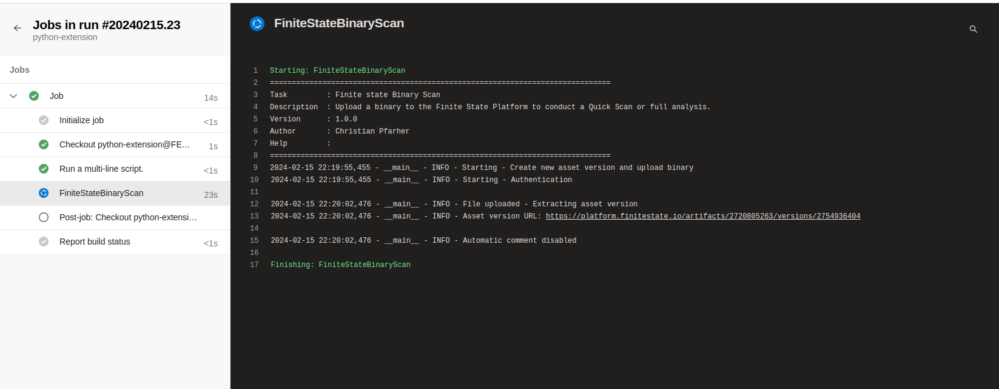

## Action Debugging

All details pertaining to the execution of the action will be recorded. You can review this information in the workflow execution logs, which is a helpful starting point if you encounter any errors during the action's run.

If you have any error, we recommend to enable the System diagnostics whe you run the pipeline:

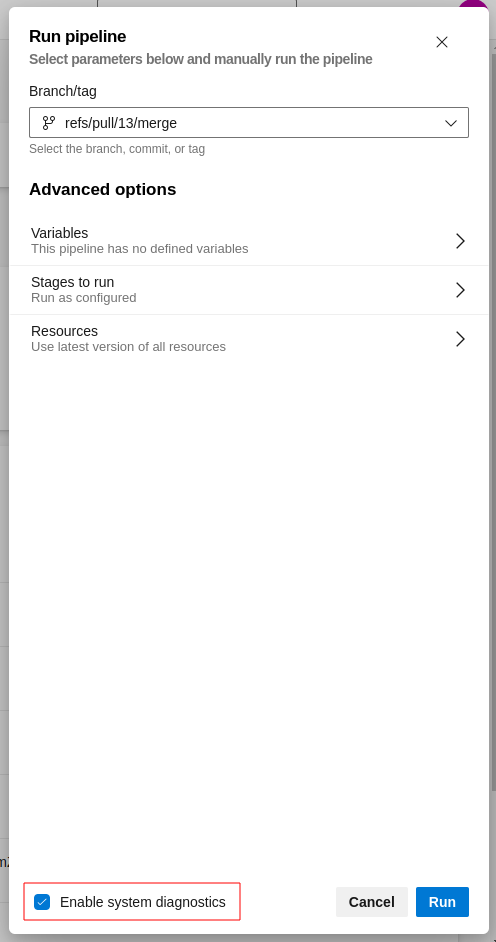

Example of output when system diagnostics is enabled:

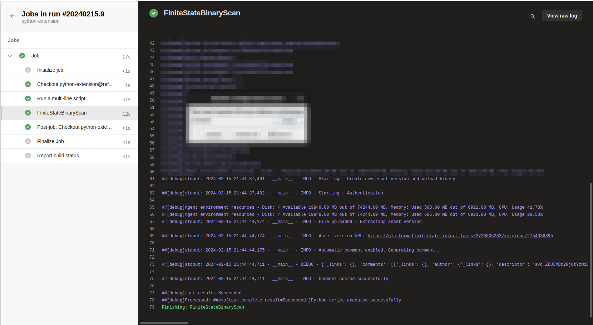

